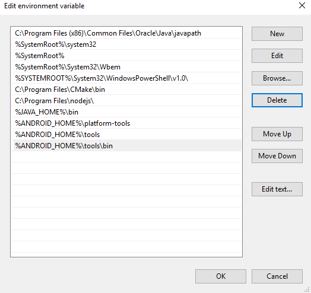
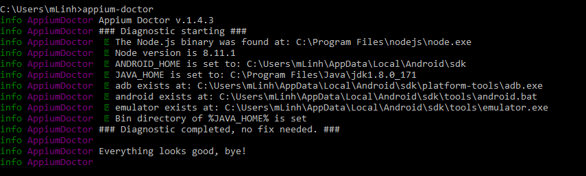
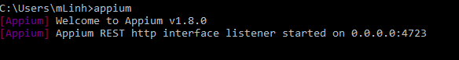

# Database Testing Report
1451058 - Lê Quang Tiến

1451018 - Tô Bạch Tùng Hiệp

## Tools
- Testing framework: Appium
- Test script IDE: IntelliJ IDEA
- Virtual device: Genymotion

## How we test

### Setup
1. Install NodeJs
2. Install Appium
```
npm install -g appium
```
3. Install Java Development Kit (JDK)
- After installation, add system variable JAVA_HOME link to JDK, for example ```C:\Program Files\Java\jdk1.8.0_171```.
- Then add ```%JAVA_HOME%\bin``` to your Path system variable.

4. Install Android SDK
- After installation, add system variable ANDROID_HOME link to Android sdk, for example ```C:\Users\your_user_name\AppData\Local\Android\sdk```.
- Add following to your Path system variable:
  - %ANDROID_HOME%\platform-tools
  - %ANDROID_HOME%\tools
  - %ANDROID_HOME%\tools\bin

- The Path variable should look like this:


5. Verify the installation
You can verify appium installation using ```appium-doctor```.
First, install it:
```
npm install -g appium-doctor
```

Then run
```
appium-doctor
```

```appium-doctor``` will verify if dependencies are setup correctly.



6. Install Genymotion and set up virtual device
7. Install IntelliJ and create a Maven project
- After creating project, add dependencies into ```pom.xml```:
```xml
<dependencies>
   <dependency>
       <groupId>io.appium</groupId>
       <artifactId>java-client</artifactId>
       <version>3.2.0</version>
   </dependency>
   <dependency>
       <groupId>org.testng</groupId>
       <artifactId>testng</artifactId>
       <version>6.9.7</version>
   </dependency>
</dependencies>
```
- Right-click Project > Maven > Reimport to import dependencies

8. Start writting test
- Our test do following:
  - Setup device, start the app
  - User Appium API ```findElementByAccessibilityId``` to navigate to tab ```videocamCamera```.
  - Use ```findElement``` to find and choose a location. Example:
  ```java
  driver.findElement(By.xpath("//*[@content-desc=\'Nam Kỳ Khởi Nghĩa - Điện Biên Phủ 1\']")).click();
  ```
  - Then we set up a for-loop. We loop 360 times. For each iteration we:
    -  sleep 20 seconds.
    -  take a screenshot
    -  save it
  - **Note**: 360 iterations * 20 seconsd sleeping = **2 hours**

9. Running the test
- Start Appium server
```
appium
```


- Remember to launch virtual device
- Run the test as you normally run any other Java project.

## Conclusion
Setting up the environment is quite difficult, as you have to set up all the required environment variables properly. However, after the setup, writing test script is easier. Appium allows us to write tests not just in Java but also other languages like Python, Javascripts, etc.

Through this project, we can see the benefits of using automation testing framework like Appium to automate a very long process (2 hours) of taking pictures. This saves human resources and can be repeated easily.